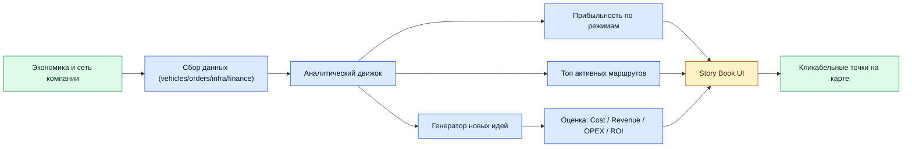
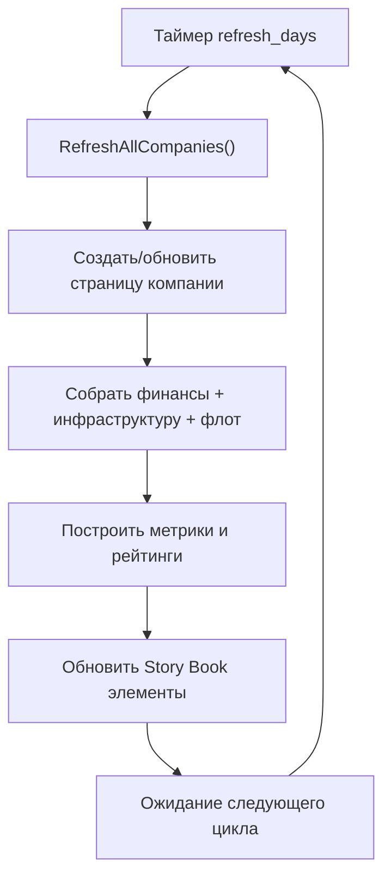
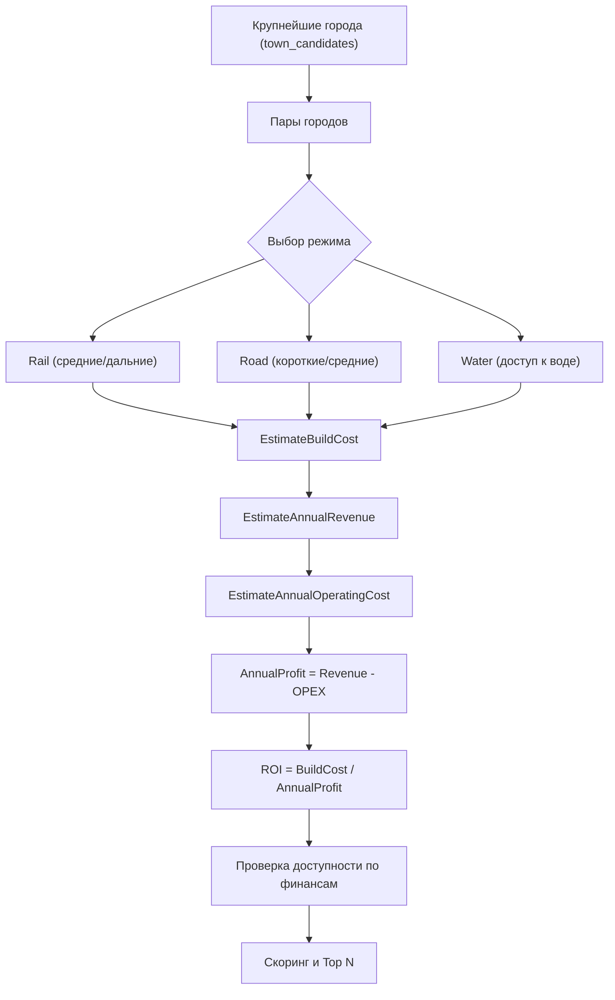

<div align="center">

# OpenTTD Smart Advisor
### Премиальный аналитический Game Script для OpenTTD

[](https://www.openttd.org/)
[](https://docs.openttd.org/gs-api/)
[](https://squirrel-lang.org/)
[](https://docs.openttd.org/gs-api/classGSStoryPage/)
[](#)
[](#)
[](#)

**Оценивает прибыльность сети, считает реальную финансовую нагрузку компании и предлагает топ маршрутов с прогнозом окупаемости.**

</div>

---

## Содержание

1. [Что это за мод](#что-это-за-мод)
2. [Ключевые возможности](#ключевые-возможности)
3. [Схемы работы](#схемы-работы)
4. [Как считаются показатели](#как-считаются-показатели)
5. [Установка](#установка)
6. [Запуск](#запуск)
7. [Настройки скрипта](#настройки-скрипта)
8. [Как читать отчет в UI](#как-читать-отчет-в-ui)
9. [Структура проекта](#структура-проекта)
10. [Ограничения](#ограничения)

---

## Что это за мод

`OpenTTD Smart Advisor` работает как **Game Script** и создает в игре удобный аналитический отчет для каждой активной компании.

Мод:

- анализирует текущую прибыльность по `rail / road / water`
- считает финансовые возможности компании и инфраструктурную нагрузку
- строит рейтинг существующих маршрутов по фактической прибыли
- генерирует новые идеи маршрутов с прогнозом:
- стоимости строительства
- годовой выручки
- годовых расходов (OPEX)
- годовой прибыли
- срока окупаемости (ROI)
- финансовой доступности для компании

---

## Ключевые возможности

| Блок | Что показывает | Практическая польза |
|---|---|---|
| Финансы компании | Cash, Loan, Free Credit, annualized метрики | Понимание реального бюджета на развитие |
| Прибыльность по режимам | Rail / Road / Water + маржинальность | Где сеть работает эффективно, а где теряет деньги |
| Топ действующих маршрутов | Рейтинг по наблюдаемой прибыли | Быстрый поиск лучших линий |
| Топ новых маршрутов | Build cost, Revenue, OPEX, Profit, ROI, Affordable | Приоритизация строительства по окупаемости |
| Кликабельные идеи на карте | Локации лучших предложений | Быстрый переход к точкам для реализации |

---

## Схемы работы

### 1) Архитектура аналитики



### 2) Цикл обновления отчета



### 3) Конвейер оценки новой идеи маршрута



---

## Как считаются показатели

### Базовые формулы

```text
AvailableFinancing = Cash + (MaxLoan - CurrentLoan)
AnnualProfit       = AnnualRevenue - AnnualOPEX
ROIYears           = BuildCost / AnnualProfit
```

### Что учитывается в анализе

- фактическая прибыль/расходы по существующему флоту
- инфраструктурные ежемесячные затраты:
- rail
- road
- canal
- station
- airport
- signals
- средние квартальные показатели компании (до 4 кварталов)
- эвристика спроса между городами и доходность перевозок пассажиров

### Как ранжируются идеи маршрутов

- чем выше прогнозируемая годовая прибыль, тем выше позиция
- если маршрут недоступен по финансам, применяется штраф
- убыточные или сомнительные варианты опускаются вниз

---

## Установка

1. Найдите пользовательскую папку OpenTTD:
- Windows: `%USERPROFILE%\Documents\OpenTTD\`
- Linux: `~/.local/share/openttd/`
- macOS: `~/Documents/OpenTTD/`
2. Создайте каталог:
- `game/OpenTTDSmartAdvisor/`
3. Поместите в него файлы:
- `info.nut`
- `main.nut`
- `README.md`

Итоговая структура:

```text
OpenTTD/
  game/
    OpenTTDSmartAdvisor/
      info.nut
      main.nut
      README.md
```

---

## Запуск

1. Откройте OpenTTD.
2. Создайте новую игру или сценарий с включенным Game Script.
3. В `Game Script Settings` выберите **OpenTTD Smart Advisor**.
4. При необходимости настройте параметры скрипта.
5. Запустите игру.
6. Откройте `Story Book / Goals` для просмотра аналитики.

Если `auto_show_page = 1`, первая страница отчета откроется автоматически после стартового анализа.

---

## Настройки скрипта

| Параметр | Назначение | Диапазон | Рекомендация |
|---|---|---|---|
| `refresh_days` | Интервал обновления аналитики | `7..120` | `21-30` |
| `top_routes` | Размер топа маршрутов/идей | `3..12` | `5-8` |
| `town_candidates` | Кол-во городов для генерации идей | `8..40` | `18-24` |
| `auto_show_page` | Автопоказ отчета | `0/1` | `1` |

---

## Как читать отчет в UI

### Financial Capability

- `Cash / Loan / MaxLoan` показывают текущую финансовую позицию
- `Available financing` показывает реальный потенциал для новых строек
- `Annualized income/expenses` помогают понять устойчивость бизнеса

### Mode Profitability

- для `Rail / Road / Water` показываются:
- число активных ТС
- суммарная прибыль
- running costs
- маржинальность
- оценочная годовая нагрузка

### Top Active Routes

- рейтинг существующих маршрутов по фактической прибыли
- удобный способ понять, какие линии уже являются ядром бизнеса

### Top Suggested Routes

- для каждой идеи:
- дистанция
- build cost
- revenue / opex / annual profit
- ROI (в годах)
- affordable (`yes/no`)

Первые 3 идеи также выводятся как кликабельные локации на карте.

---

## Структура проекта

```text
OpenTTDSmartAdvisor/
  info.nut   # регистрация скрипта, метаданные, настройки
  main.nut   # аналитический движок, UI, генерация идей
  README.md  # документация
```

---

## Ограничения

- Оценки основаны на эвристиках, а не на полном симуляторе строительства.
- Водные маршруты проверяются по доступности воды рядом, без полного pathfinding.
- Качество анализа существующих маршрутов зависит от корректности приказов транспорта.

---

## Технические примечания

- Целевой API: OpenTTD Game Script API `v15` (`GetAPIVersion = "15"`).
- Основной интерфейс отчета: `GSStoryPage`.
- Поддерживаемые режимы анализа: `Rail`, `Road`, `Water`.

---

<div align="center">

### OpenTTD Smart Advisor
**Аналитика, которой удобно пользоваться в реальной партии.**

</div>
